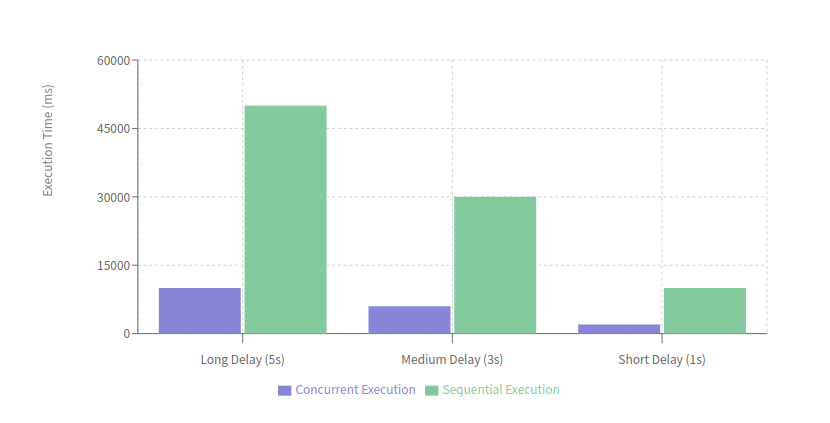

# Concurrent Testing Framework

## Overview

This project demonstrates the use of a custom multi-threaded testing framework to compare the performance of sequential and concurrent test execution. The framework uses custom annotations to specify the execution mode and order of tests.

## Custom Annotations

1. **@Test**: Marks a method as a test method.
2. **@Order**: Specifies the order in which the test methods should be executed.
3. **@RunMode**: Specifies whether the test should be run sequentially or concurrently.
   ```java
   package org.assignment.annotations;

   import java.lang.annotation.ElementType;
   import java.lang.annotation.Retention;
   import java.lang.annotation.RetentionPolicy;
   import java.lang.annotation.Target;

   @Retention(RetentionPolicy.RUNTIME)
   @Target(ElementType.METHOD)
   public @interface RunMode {
       ExecutionMode value() default ExecutionMode.SEQUENTIAL;
   }
   ```
4. **ExecutionMode**: Enum with values `SEQUENTIAL` and `CONCURRENT` to specify the execution mode.

## Testing Framework

The testing framework uses a custom JUnit runner (`CustomTestRunner`) to handle the custom annotations and execute the tests accordingly. The `ThreadPool` class is used to manage concurrent execution of tasks.

### File Structure

```
├── gradle
│   ├── libs.versions.toml
│   └── wrapper
│       ├── gradle-wrapper.jar
│       └── gradle-wrapper.properties
├── gradlew
├── gradlew.bat
├── lib
│   ├── build.gradle.kts
│   └── src
│       ├── main
│       │   ├── java
│       │   │   └── org
│       │   │       └── assignment
│       │   │           └── ListSynchronization.java
│       │   └── resources
│       └── test
│           ├── java
│           │   └── org
│           │       └── assignment
│           │           ├── annotations
│           │           │   ├── ExecutionMode.java
│           │           │   ├── Order.java
│           │           │   ├── RunMode.java
│           │           │   └── Test.java
│           │           ├── CustomTestRunner.java
│           │           ├── TestRunner.java
│           │           └── ThreadPool.java
│           └── resources
├── README.md
├── settings.gradle.kts
```

### Code Used for Testing

The code includes a delay parameter to simulate a function that takes a specified amount of time to execute.

```java
package org.assignment;

public class ListSynchronization {

    public boolean simpleTestMethod() {
        return true;
    }

    public boolean delayedMethod(int delayMillis) {
        try {
            Thread.sleep(delayMillis);
        } catch (InterruptedException e) {
            Thread.currentThread().interrupt();
            return false;
        }
        return true;
    }
}
```

### Performance Measurement and Comparison

#### Performance Analysis Based on Output



- **Concurrent Execution**:

  - **Long Delay (5 seconds)**: Completed in approximately 10,003 ms.
  - **Medium Delay (3 seconds)**: Completed in approximately 6,003 ms.
  - **Short Delay (1 second)**: Completed in approximately 2,003 ms.
- **Sequential Execution**:

  - **Long Delay (5 seconds)**: Completed in approximately 50,001 ms.
  - **Medium Delay (3 seconds)**: Completed in approximately 30,001 ms.
  - **Short Delay (1 second)**: Completed in approximately 10,001 ms.

#### Conclusion based On Critical Analysis

The multi-threaded framework significantly reduces the total execution time for all tests compared to the sequential execution. The concurrent tests complete much faster due to parallel execution, demonstrating the benefits of using concurrency in test execution.

## Project Tools and Libraries

In this project, I've selected tools and libraries to create a robust and efficient Java library. Here's an overview:

### Build System and Programming Language

I've chosen Gradle as my build automation tool for its flexibility and powerful Kotlin DSL. The project targets Java 8 compatibility, with the Java toolchain configured in Gradle for consistency.

### Testing and Key Libraries

For testing, I'm using JUnit to maintain high code quality and reliability. Key libraries include:

- **Apache Commons Math**: An API dependency providing a wide range of mathematical utilities.
- **Google Guava**: An implementation dependency used internally for its efficient collection types and utilities.

### Dependency Management and Test Configuration

Dependencies are resolved through Maven Central, ensuring easy access to a vast ecosystem of Java libraries. Detailed test logging captures comprehensive information during test runs, including:

- Logging for passed, skipped, and failed tests
- Standard output and error streams
- Full exception details with causes and stack traces

This setup helps quickly identify and debug issues, allowing for the development of a mathematically-focused Java library with a strong emphasis on code quality and thorough testing. The project structure separates API and implementation dependencies, providing flexibility for future development and maintenance.

---

---
